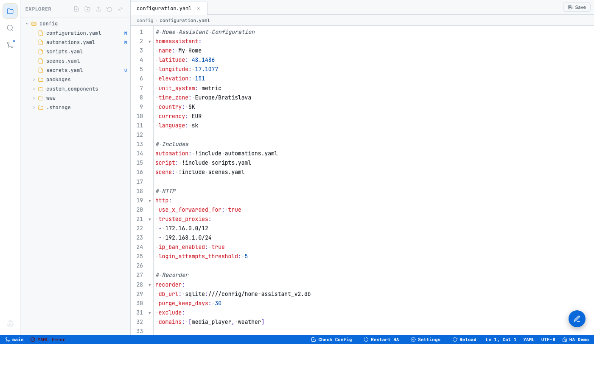
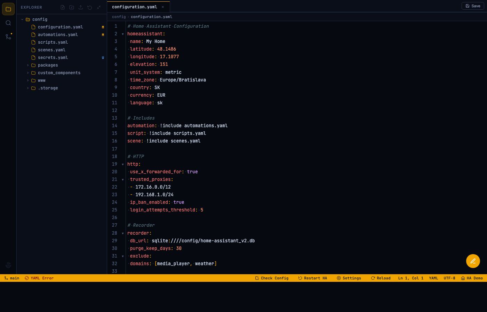
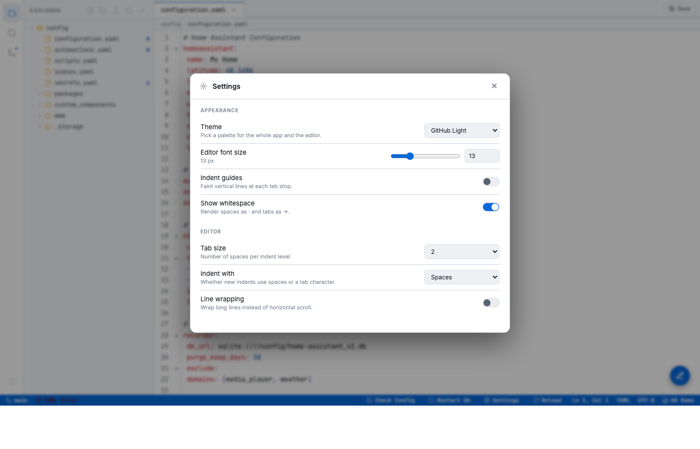
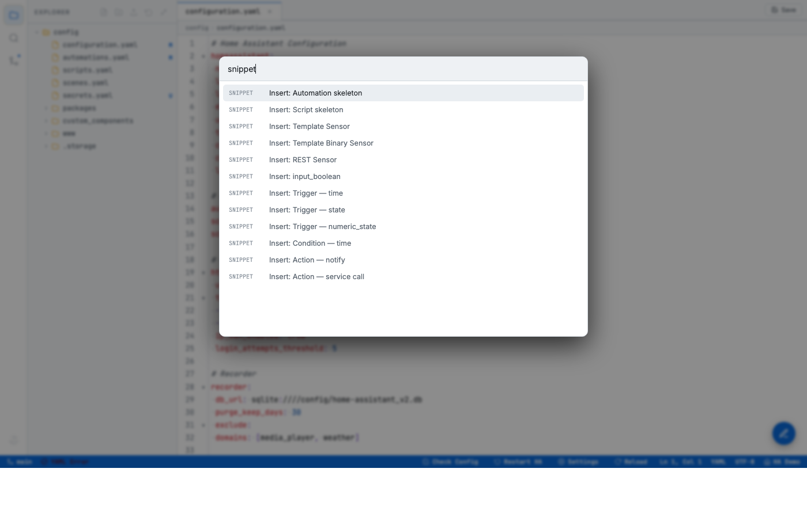
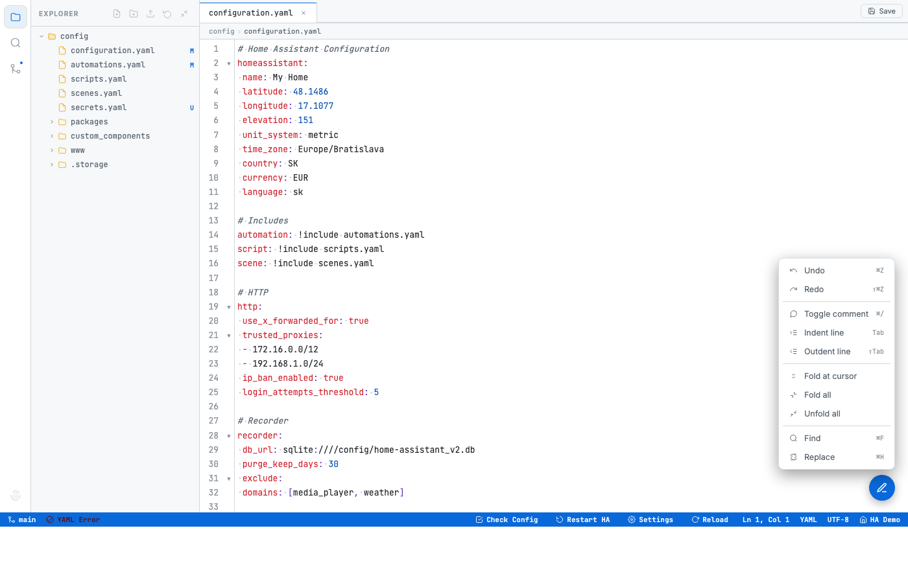
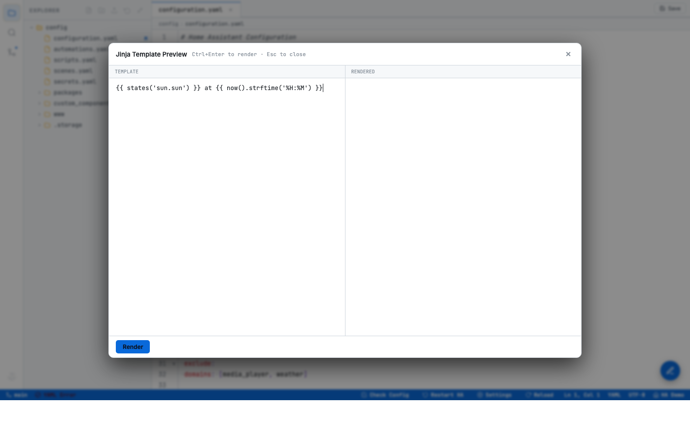
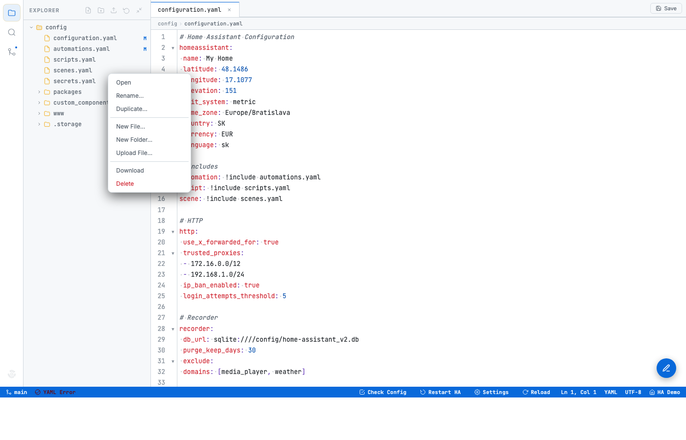

# Thoky's Home Assistant Add-ons

Home Assistant add-on repository hosting:

- **[File Editor Pro](./file_editor_pro)** — a modern multi-tab editor for your HA config with YAML validation, fold gutters, cross-file search, git-style badges, a collapsible file tree, HA-aware autocomplete, a command palette, YAML snippets and a Jinja template preview.

## Preview


*Main view in the default GitHub Light theme: file tree with git status badges, syntax highlighting, fold gutters, breadcrumb, visible whitespace dots, Save button, status bar with HA actions, and a floating pencil menu for editor commands.*


*Same app in the HA Dark theme. Eight themes ship in total (five light, three dark); switch via Settings or the command palette.*


*Settings modal — theme picker, editor font size, tab size, indent style, indent guides, show-whitespace, line wrapping. Preferences persist in `localStorage`.*


*Command palette (`Ctrl+Shift+P`). Fuzzy-filter across file ops, views, git, HA actions, YAML snippets, and every file in the tree.*


*Floating pencil menu at bottom-right: undo, redo, toggle comment, indent/outdent, fold at cursor, fold/unfold all, find, replace.*


*Jinja template preview (`Ctrl+Alt+J`). Split-pane modal renders through HA's `/api/template`. Seeds from editor selection; `Ctrl+Enter` renders.*


*Right-click on any tree item for Open, Rename, Duplicate, New File/Folder, Upload, Download, Delete.*

## Installation

1. In Home Assistant go to **Settings → Add-ons → Add-on Store**.
2. Click the ⋮ menu (top-right) → **Repositories**.
3. Add this URL:

   ```
   https://github.com/Thoky81/ha-file-editor-pro
   ```

4. The add-ons from this repo will appear at the bottom of the store. Install **File Editor Pro**, start it, and open the Web UI (or use the sidebar panel — ingress is enabled).
